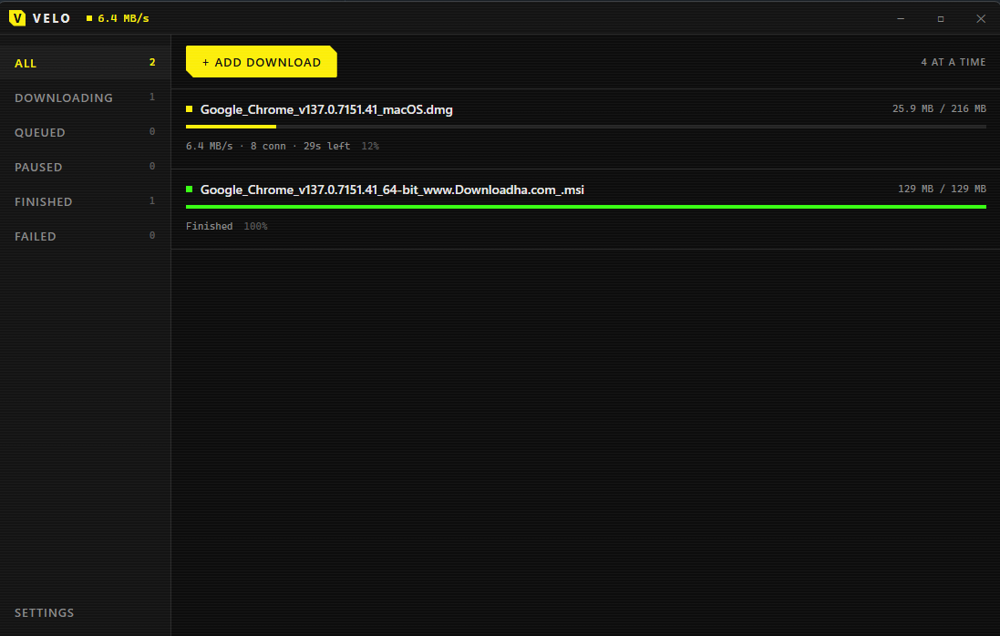
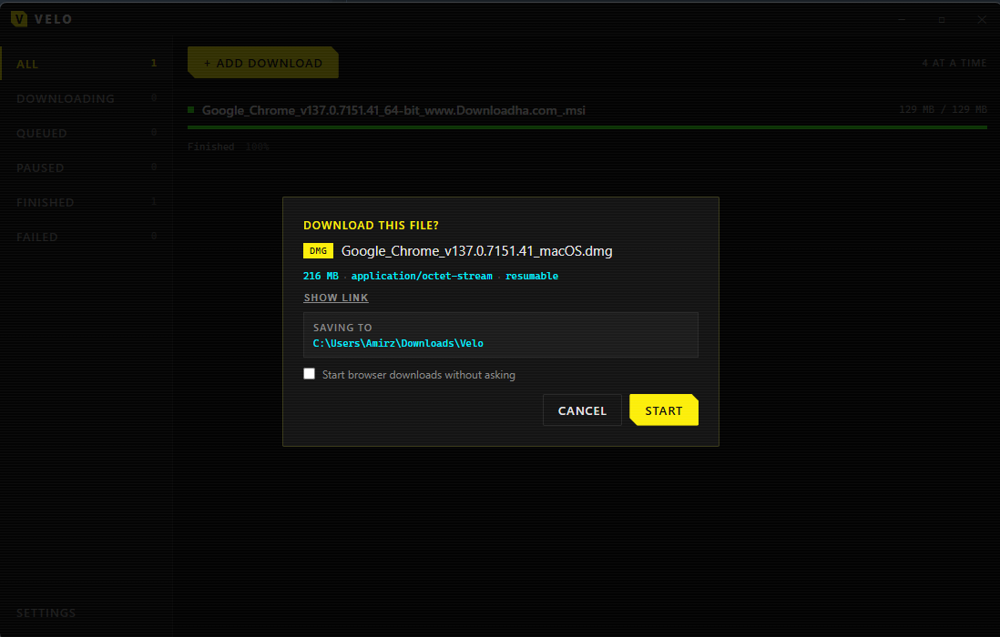
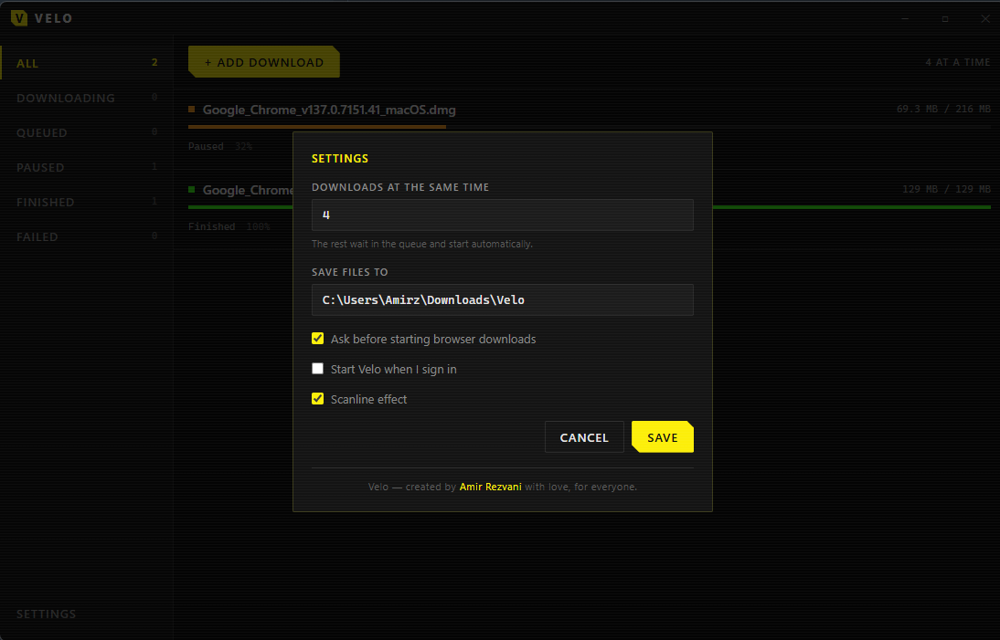

<div align="center">

# Velo

**A fast, free download manager for Windows and macOS.**

Downloads files in parallel pieces, resumes cleanly, and takes over downloads
from your browser. Open source, no ads, no accounts, no tracking.

</div>



---

## What it does

- **Downloads faster.** Velo splits a file into several pieces and downloads
  them at the same time, then puts them back together. When one piece finishes
  early it takes over half of whatever piece is furthest behind, so no
  connection sits idle at the end.
- **Takes over your browser downloads.** Click a download link in your browser
  and it starts in Velo instead, with a prompt showing the file name, size and
  where it will be saved.
- **Grabs many links at once.** Highlight a bunch of links on a page, right
  click, and pick them off a list. They queue up and download one after another.
- **Pauses and resumes.** Stop a download, close the app, come back tomorrow,
  carry on from where it left off.
- **Stays out of your way.** Closing the window parks Velo in the tray so
  downloads keep running. It can start with your computer if you want.

---

## Install

### Windows

1. Go to the [Releases page](https://github.com/Amirzvni/velo/releases) and
   download `Velo_x.x.x_x64-setup.exe`.
2. Run it.
3. Windows will show a blue **"Windows protected your PC"** box. This is
   normal for free software that has not paid for a signing certificate.
   Click **More info**, then **Run anyway**.
4. Follow the installer. Velo appears in your Start menu.

### macOS

1. Download `Velo_x.x.x_x64.dmg` from the
   [Releases page](https://github.com/Amirzvni/velo/releases).
2. Open it and drag Velo to Applications.
3. The first time you open it, macOS will refuse. **Right click** the Velo app
   and choose **Open**, then **Open** again in the box that appears. You only
   have to do this once.

Files are saved to your **Downloads → Velo** folder by default.

---

## Set up the browser extension

The extension is what makes downloads start in Velo instead of your browser.
It is not in the Edge or Chrome stores yet, so you install it from the folder
yourself. It takes about a minute.

**1. Get the extension folder.**

Download the source code zip from the
[Releases page](https://github.com/Amirzvni/velo/releases) and unzip it. The
folder you need is `extension/dist`.

**2. Open your browser's extension page.**

| Browser | Address to paste in the address bar |
| --- | --- |
| Microsoft Edge | `edge://extensions` |
| Google Chrome | `chrome://extensions` |
| Brave | `brave://extensions` |

**3. Turn on Developer mode.** It is a switch on that page — bottom left in
Edge, top right in Chrome.

**4. Click "Load unpacked"** and choose the `extension/dist` folder.

**5. Open Velo, then click the Velo icon in your browser toolbar** and press
**Connect to Velo**. Velo will ask you to allow the connection. Click
**Allow**. That is it — you never have to do this again.

> If you do not see the Velo icon in the toolbar, click the puzzle piece icon
> and pin it.

---

## Using it

### One file

Click any download link. Velo asks what you want to do:



Press **Start** and it downloads. Tick **Start browser downloads without
asking** if you would rather skip this prompt in future.

You can also paste a link straight into Velo with the **+ Add download**
button.

### Many files at once

1. Select the links on the page by dragging across them, the same way you
   select text.
2. Right click and choose **Download all links with Velo** — or just press
   **Alt + V**.
3. Untick anything you do not want, then press **Download**.

They all queue up in Velo and download one after another, each at full speed.

### Pausing, resuming, removing

Hover over any download in the list:

- **Pause** stops it. **Resume** picks up exactly where it stopped, even after
  restarting your computer.
- **Open** shows a finished file in your file manager.
- **Remove** takes it off the list. A finished file stays on your disk; an
  unfinished one is deleted, since half a file is no use to anyone.

---

## Settings



| Setting | What it does |
| --- | --- |
| Downloads at the same time | How many files download at once. Files from the same website still go one at a time, because most servers slow you down if you open too many connections. |
| Ask before starting browser downloads | Turn the confirmation prompt on or off. |
| Start Velo when I sign in | Velo launches quietly in the tray at login. |
| Scanline effect | The subtle CRT lines over the interface. Turn it off for a plain dark theme. |

---

## Common problems

**The extension says "Not connected".**
Velo has to be running. Open it, then press **Connect to Velo** in the
extension popup.

**Downloads still go to my browser.**
Open the extension popup and check **Send browser downloads to Velo** is
ticked. If Velo was closed when you clicked the link, the extension hands the
download back to the browser on purpose so you do not lose it.

**I closed Velo but it is still running.**
That is intended — it sits in the tray near the clock so downloads keep going.
Right click the tray icon and choose **Quit Velo** to close it properly.

**Windows says the installer is unsafe.**
Velo is not code signed, because a certificate costs money every year. The
source code is all here if you want to read it or build it yourself.

---

## Building it yourself

You need [Rust](https://rustup.rs), [Node.js 20+](https://nodejs.org), and:

- **Windows:** Visual Studio Build Tools with the *Desktop development with
  C++* workload.
- **macOS:** Xcode command line tools (`xcode-select --install`).
- **Linux:** `libwebkit2gtk-4.1-dev`, `libgtk-3-dev`, `libayatana-appindicator3-dev`,
  `librsvg2-dev`, `build-essential`, `pkg-config`.

```bash
git clone https://github.com/Amirzvni/velo.git
cd velo
npm install
npm run tauri dev        # run it
npm run tauri build      # make an installer
```

Build the extension too:

```bash
cd extension
npm install
npm run build            # output lands in extension/dist
```

Installers appear in `target/release/bundle/`.

---

## How it is built

| Part | Technology |
| --- | --- |
| Download engine | Rust — parallel range requests, dynamic piece stealing, resume journal |
| Storage | SQLite |
| Desktop app | Tauri v2 |
| Interface | Vue 3 + TypeScript |
| Browser link | A small local server on `127.0.0.1`, reachable only from your own machine |

crates/velo-core the download engine
crates/velo-store the database
crates/velo-manager the queue and scheduler
crates/velo-cli a command line harness for testing
src-tauri the desktop app and local API
src the interface
extension the browser extension


---

## Privacy

Velo collects nothing. No analytics, no telemetry, no account, no data leaves
your computer except the requests needed to fetch the files you asked for.
Full details in [PRIVACY.md](PRIVACY.md).

---

## Contributing

Issues and pull requests are welcome at
[github.com/Amirzvni/velo](https://github.com/Amirzvni/velo).

## License

MIT — see [LICENSE](LICENSE).

---

<div align="center">

Created by **Amir Rezvani** with love, for everyone.

</div>
